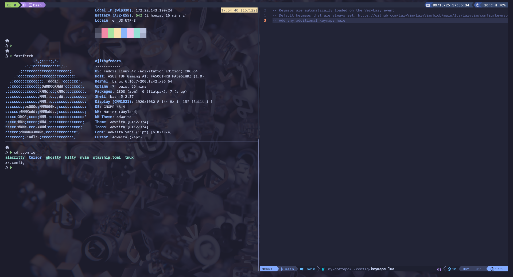

# my-dotrepo

These are my personal dotfiles managed with [GNU Stow](https://www.gnu.org/software/stow/) and [Ansible](https://www.ansible.com/).

Tested on Fedora 42.

## Installation

```bash
sudo dnf install -y ansible stow git
ansible-pull -U https://github.com/aju773/my-dotrepo.git -i localhost, bootstrap-ansible/playbook.yml --ask-become-pass
```

## Preview

